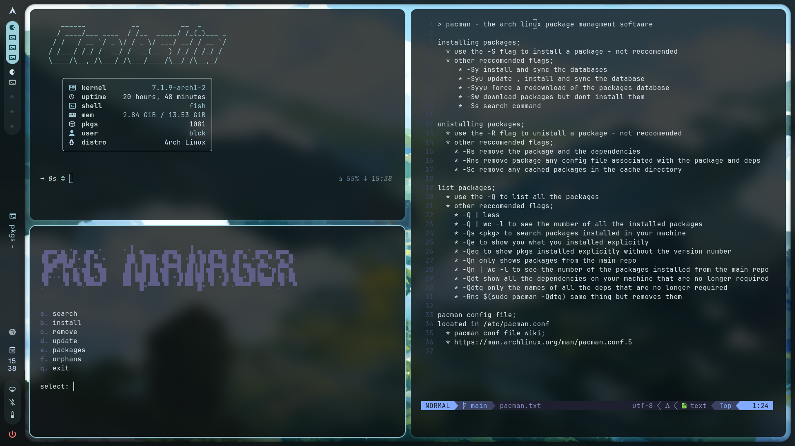

## !! 
```rust
os : **arch linux**
wm : **hyprland / caelestia shell**
shell : **fish**
terminal : **foot**
editor : **nvim**
```


## ??
for everything text me on discord : @parano_d

## ⭐ 
a star would be appreciated
